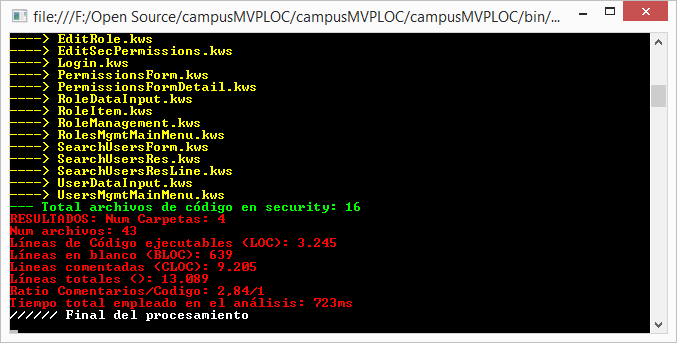

# campusMVPLOC
Contador de líneas de código con estadísticas para Windows, de [**campusMVP**](http://www.campusmvp.es).


## Líneas de código como medida del tamaño de un software

El **número de líneas de código o LOC** (de *Lines Of Code* en inglés) son una métrica estándar que se utiliza para determinar **el tamaño de un desarrollo informático**  y también en cierta medida dan una idea **del esfuerzo que se ha necesitado** para crearlo. 

Las LOC son una **medida un tanto imprecisa**, porque se puede escribir código más o menos compacto según el estilo de cada uno,  hay lenguajes con sintaxis más "charlatanas" que otras y por tanto que generan más líneas, y las propias guías de estilo y normas de cada empresa pueden hacer que varíen.

No obstante la métrica LOC y sus relacionadas **nos proporcionan una idea muy buena del tamaño de un desarrollo software** y puede ser interesante para muchas cosas.

Además de líneas de código en total es interesante medir también algunas métricas relacionadas, sobre todo qué cantidad de comentarios se han incluido y qué **ratio existe entre estos comentarios y las líneas de código reales** que realmente quedan.

También es interesante saber cuántas de estas líneas están en blanco o están formadas por solo por espacios y tabuladores.

##¿Por qué crear campusMVPLOC?

En el mercado existen diversos programas para contar líneas de código, gratuitos e incluso de código abierto. Sin embargo no satisfacían mis necesidades porque ninguno de los que tenía a mano me permitían **redefinir muchos de los parámetros** que necesitaba, como: 

- **Las extensiones de archivos** de código a inspeccionar (por ejemplo, en campusMVP usamos extensiones propias para tipos de archivos en un lenguaje interno propio).
- **Las carpetas que necesito excluir del contaje**, con expresiones flexibles para conseguirlo.
- **Las expresiones que se consideran comentarios**, aparte de las mas comunes. Por ejemplo, en los archivos desarrollados con nuestro lenguaje interno los comentarios se expresan con una sintaxis especial también, pero no tenía forma de contabilizarlos como tales. Existen además muchos lenguajes de programación <a href="https://en.wikipedia.org/wiki/Comparison_of_programming_languages_(syntax)#Block_comments"> con sintaxis propias para comentarios</a>, y que van más allá de los habituales `//` o `/* ... */`.

Por eso me he decidido a crear, lo más rápido que he podido, un pequeño programa de consola que nos permite obtener métricas de LOC de una forma muy flexible y rápida.

El programa se llama campusMVPLOC y su sintaxis es la siguiente:

```
campusMVPLOC "carpeta-de-Codigo" [/f:tipos-archivo] [/c:regEx comentarios] [/x:regEx carpetas excluidas] [/s] [/b] /?
```
Este es el tipo de resultados que muestra:



##Parámetros de uso
Los parámetros que admite el programa son los siguientes y se pueden especificar con "/" o con "-" indistintamente:

- **"Carpeta.de-codigo"**: es el único obligatorio. Indica la ruta absoluta o relativa donde se encuentra el código que queremos analizar. Debe existir y ser accesible
- **[/f:tipos-archivo]**: Sirve para indicar, opcionalmente, qué tipos de archivos queremos considerar archivos de código. Se definen como una lista separada por comas de patrones de archivos que admiten "*" y "?" para definirlos de la misma manera que el comando "dir" de la consola del sistema. Por ejemplo: `/f:*.js,*.css`. Por defecto, si no se indica nada, se consideran los archivos: `*.js,*.json,*.htm,*.html,*.css,*.ts,*.cs,*.vb,*.cpp,*.h,*.java`. Si se indica otra cosa en este parámetro **se considera únicamente lo indicado en el parámetro**, sobrescribiendo la lista por defecto, así que si se quieren añadir archivos a la lista por defecto hay que indicarlos todos.
- **[/c:regEx comentarios]**: una lista de expresiones regulares para detectar comentarios, separadas por comas. Se trata solo de **comentarios de una línea**, no comentarios multi-línea. Para comentarios por bloque/multilínea habría que tocar el código fuente, pero es muy sencillo añadirlos como veremos en un rato. Por ejemplo, para detectar comentarios en T-SQL o en Haskell (son dos guiones seguidos `--`) podrías añadir esta expresión regular como parámetro: `/c:^[\s\t]*--.*?$` que identificará los comentarios con doble guión.
- **[/x:regEx carpetas excluidas]**: permite excluir carpetas con ciertos nombres del proceso de contaje. De este modo es muy fácil excluir algunas carpetas que están en nuestro código pero no son nuestras o no queremos contarlas por el motivo que sea. La expresión regular **se aplicará al nombre de la carpeta** no a la ruta completa de ésta. Se ha hecho así por sencillez de uso, aunque en algunas circunstancias podría ser más flexible aplicarlo a la ruta completa, aunque fuera más complicado de utilizar este parámetro. Si ese es tu caso lo mejor es que toques el código para conseguirlo, lo cual es extremadamente sencillo y solo implica cambiar `carpeta.Name`por `carpeta.FullName` en la línea correspondiente. Ej: `/x:Aux|Externos` hará que las carpetas cuyo nombre **contenga** "Aux" o "Externos" no se incluyan en el contaje de código. Si queremos que sea el nombre exacto habría que usar las siguientes expresiones regulares:  `/x:^Aux$|^Externos$` para indicar el principio y final del nombre.
- **/s**: modo silencioso. Por defecto el programa muestra por consola, con diferentes colores, las carpetas y archivos que va procesando, así como unos mensajes de inicio y final de proceso. Con este parámetro no muestra nada por pantalla hasta el final, y solo muestra los resultados del análisis. Suele ser útil para guardar los resultados a un archivo, especialmente en el modo "batch".
- **/b**: modo "batch". En el modo normal de funcionamiento el programa se detiene al final y espera a que el usuario pulse una tecla para terminar. Esto ofrece la posibilidad de ver los resultados con calma sin que se cierre la ventana de la línea de comandos. Con el modo "batch" activado el programa termina y no espera por interacción alguna del usuario. Esto es útil para cuando se usa campusMVPLOC como parte de un proceso por lotes en el que se van enlazando llamadas a diversos programas, o si lo queremos programar y que guarde la información a disco.
- **/?**: muestra la ayuda de la aplicación. Si no se especifica ningún parámetro se consigue el mismo efecto.

##Ejemplos de uso

- Contar las líneas de código de la carpeta "MiApp":

```
campusmvpLOC.exe "D:\Codigo\MiApp"
```

Fíjate en que es importante utilizar comillas en la ruta de la carpeta a analizar porque si tiene espacios en blanco por el medio fallaría el comando. Esto algo común a todos los programas de líneas de comandos en Windows.

Sin especificar parámetro alguno buscará código en los archivos con las extensiones: `*.js,*.json,*.htm,*.html,*.css,*.ts,*.cs,*.vb,*.cpp,*.h,*.java`

- Contar las líneas de código de "MiApp" escrita en ASP clásico:

```
campusmvpLOC.exe "D:\Codigo\MiApp" /f:*.asp,*.htm,*.html,*.css,*.js,*.inc
```

En ASP clásico se usa VBScript además de HTML, CSS y JavaScript, por eso hay que indicar todos estos tipos de archivo.

- Contar las líneas de código de "MiApp" escrita en T-SQL:

```
campusmvpLOC.exe "D:\Codigo\MiApp" -f:*.sql, -c:^[\s\t]*--.*?$ 
```

En Transact-SQL los archivos tienen extensión .sql y los comentarios se realizan con líneas de tipo "--" o bien con los bloques multi-línea tracionales de muchos lenguajes "/* */" que ya están incluidos por defecto en la aplicación, por eso se añade solamente la exprfesión regular para buscar los dobles guiones. Fíjate en cómo se utiliza `^[\s\t]*` para contemplar la posibilidad de que haya espacios o tabuladores delante de los comentarios, pero no otro tipo de contenido que si serían considerados código.

Fíjate en que puedes usar indistintamente "/" o "-" para marcar los parámetros que se usan, incluso mezclando ambas fórmulas.

- Contar las líneas de código de "MiApp" excluyendo las carpetas "Aux" y "Componentes":

```
campusmvpLOC.exe "D:\Codigo\MiApp" -x:^Aux$|^Componentes$
```

Si quisiésemos que se excluyeran las carpetas que lleven en su nombre la palabra "Aux", indpendientemente de dónde esté esa palabra (por ejemplo, las carpetas "Auxiliares" o "ComponentesAux", podríamos simplificar la expresión regular así:

```
campusmvpLOC.exe "D:\Codigo\MiApp" -x:Aux
```

- Contar las líneas de código de "MiApp" mostrando solo el resultado y en modo "batch":

```
campusmvpLOC.exe "D:\Codigo\MiApp" -s -b
```

## Comentarios sobre el programa

La solución está creada con Visual Studio 2015 Community Edition (gratuita) y la .NET Framework 4.6.

[Licencia Apache 2.0](http://www.apache.org/licenses/LICENSE-2.0)